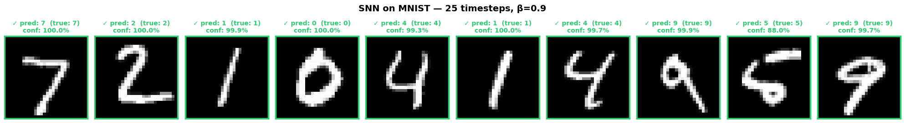
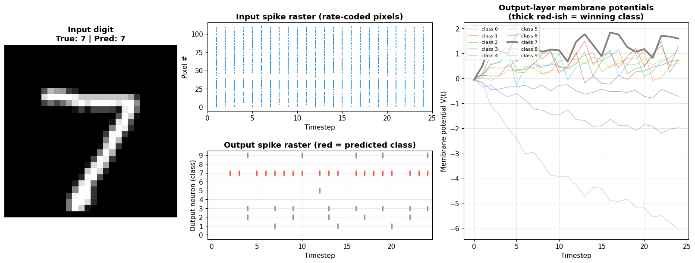
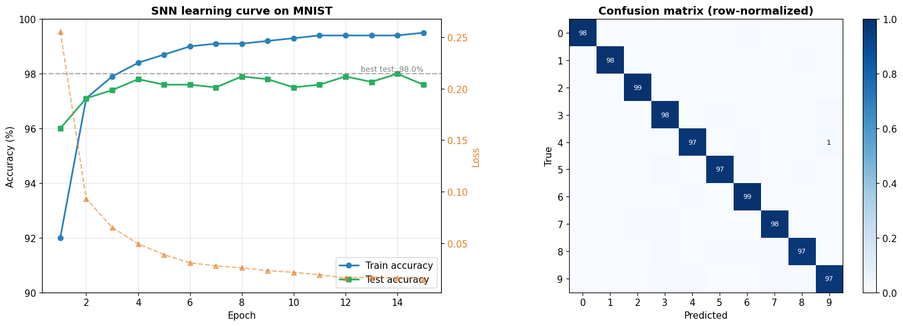

# Spiking Neural Networks on MNIST

> A biologically-inspired, event-driven neural network trained with surrogate gradients — achieving **98% test accuracy** on MNIST using discrete spike trains instead of continuous activations.

[](https://www.python.org/)
[](https://pytorch.org/)
[](https://snntorch.readthedocs.io/)
[](LICENSE)

---

## Overview

Spiking Neural Networks (SNNs) — the **"third generation"** of neural networks — replace continuous floating-point activations with discrete binary spikes emitted over time, mimicking how biological neurons actually communicate. They are the foundation of next-generation **neuromorphic hardware** (Intel Loihi 2, BrainChip Akida, SpiNNaker) and can deliver **10–100× lower energy consumption** than equivalent ANNs on edge devices.

This project implements a 3-layer **Leaky Integrate-and-Fire (LIF)** spiking network in [snnTorch](https://snntorch.readthedocs.io/) + PyTorch, trains it on MNIST via **surrogate-gradient backpropagation through time**, and explores its internal spike dynamics.

## Highlights

- **98.0% test accuracy** on MNIST — within ~1% of an equivalent dense ANN
- Fully **event-driven inference**: predictions emerge from spike counts and membrane integration, not a single forward pass
- **Rate-coded** pixel-to-spike conversion across `T = 25` simulated timesteps
- **Surrogate gradients** to backpropagate through the non-differentiable spike function
- Rich visualizations of spike rasters, membrane potential dynamics, and per-class confusion

---

## Architecture

```
Input (28×28)  →  Rate Coding (T=25 spike trains)
                          ↓
              Linear(784 → 256) → LIF Neuron (β=0.9)
                          ↓
              Linear(256 → 128) → LIF Neuron (β=0.9)
                          ↓
              Linear(128 →  10) → LIF Neuron (β=0.9)
                          ↓
                Spike counts over T timesteps
                          ↓
                   argmax → prediction
```

The **LIF neuron** dynamics each timestep:

$$
V(t+1) = \beta \cdot V(t) + \sum (w \cdot \text{input spikes}) - \theta \cdot \text{output spike}
$$

where β is the membrane decay (0.9 here) and θ is the firing threshold.

---

## Results

| Metric | Value |
|---|---|
| Best test accuracy | **98.0%** |
| Train accuracy | 99.5% |
| Epochs | 15 |
| Timesteps (T) | 25 |
| Membrane decay (β) | 0.9 |
| Optimizer | Adam (lr = 1e-3) |
| Loss | Cross-entropy on spike counts |
| Parameters | ~235K |

### Predictions



### Spike dynamics & membrane potentials



The output neuron whose membrane potential rises fastest "wins" the classification — a fundamentally different inference mechanism from ANN softmax outputs.

### Training curve & confusion matrix



---

## SNN vs. ANN

| Aspect | Standard ANN | Spiking Neural Network |
|---|---|---|
| **Signal** | Continuous floats | Binary spikes (0/1) over time |
| **Time** | Single forward pass | Simulated over T timesteps |
| **Neuron** | ReLU / GELU | LIF (stateful, leaky integrator) |
| **Computation** | Dense MAC ops | Event-driven (sparse) |
| **Hardware fit** | GPU / TPU | Neuromorphic chips |
| **Energy** | High, constant | Potentially 10–100× lower |
| **Training** | Direct backprop | Surrogate gradients |

---

## Why this matters

SNNs are uniquely suited to:

- **Always-on edge AI** — keyword spotting, anomaly detection, wearables
- **Event-camera vision** — DVS sensors, high-speed robotics
- **Brain–machine interfaces** — biologically faithful temporal processing
- **Ultra-low-power inference** — sub-milliwatt budgets on neuromorphic silicon

---

## Quick Start

```bash
# Install dependencies
pip install torch torchvision snntorch matplotlib

# Open and run the notebook
jupyter notebook snn.ipynb
```

Training takes ~5 minutes on a single GPU (or ~30 minutes on CPU).

---

## Project Structure

```
.
├── snn.ipynb              # Main notebook — architecture, training, visualizations
├── snn_mnist_best.pt      # Best model checkpoint (generated)
├── snn_predictions.png    # Sample predictions (generated)
├── snn_dynamics.png       # Spike raster + membrane potentials (generated)
├── snn_training.png       # Learning curve + confusion matrix (generated)
└── README.md
```

---

## Key Concepts Demonstrated

- Leaky Integrate-and-Fire neuron dynamics
- Rate coding for converting static inputs to spike trains
- Backpropagation Through Time (BPTT) with surrogate gradients
- Spike-count-based loss functions
- Temporal credit assignment in non-differentiable networks
- Trade-off analysis: accuracy vs. energy vs. hardware compatibility

---

## References

- Eshraghian et al., [*Training Spiking Neural Networks Using Lessons From Deep Learning*](https://arxiv.org/abs/2109.12894) (2021)
- [snnTorch documentation](https://snntorch.readthedocs.io/)
- [Intel Loihi 2 neuromorphic platform](https://www.intel.com/content/www/us/en/research/neuromorphic-computing.html)

---

<p align="center"><i>Built with snnTorch + PyTorch</i></p>
